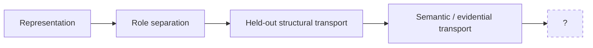

# SSI — Safe Self-Improvement

> **Research on reality-tracking interfaces, scoped authority, evidence typing, and corrigible transformation.**

SSI studies a recurring failure mode in adaptive systems: a system can produce a locally correct answer, transformation, or certificate while still lacking the authority or information needed to generalize that success across a boundary.

The program therefore separates questions that are often collapsed:

```text
Can != May != Did
information != evidence != authority
representation != legitimacy of representation
semantic identity != evidence admission != provenance != uncertainty
local preservation != path preservation
```

The repository is empirical-first. Claims are frozen at the narrowest scope actually supported by preregistered or independently constituted cases, oracles, protocols, evaluators, and first results.

---

## Current frontier

The newest transition/relicense sequence has earned three distinct rungs:



| Rung | Experiment | Strongest earned result | Explicit ceiling |
|---|---|---|---|
| **Role separation** | [`transition_interface_separability_v0_1`](research/relicense/transition_interface_separability_v0_1/) | `FOUR_COORDINATE_TRANSITION_INTERFACE_SEPARABILITY = SUPPORTED_ON_FROZEN_CONSTRUCTED_SUITE` | completeness, real-world boundary generalization, boundary semantics: **not established** |
| **Held-out structural transport** | [`transition_interface_separability_heldout_stress_v0_1`](research/relicense/transition_interface_separability_heldout_stress_v0_1/) | G1/G3/G4/G5 supported on frozen held-out axes | G2 novel-channel transport: **not evaluable under the frozen binding**; full generalization: **not established** |
| **Semantic / evidential transport** | [`transition_semantic_transport_v0_1`](research/relicense/transition_semantic_transport_v0_1/) | `TRANSITION_SEMANTIC_TRANSPORT = SUPPORTED_ON_FROZEN_CONSTRUCTED_CROSS_CARRIER_SUITE` | held-out semantic transport, universal carrier equivalence, boundary semantics: **not established** |
| **Post-PR61 frontier** | — | **structured ignorance** | deliberately **unconstituted** |

The blank is intentional. The strongest surviving constraint is:

> **A system may preserve every locally certified object while still failing to preserve the legitimacy of the path connecting them.**

This supports the non-rule

```text
Legit(T1) AND Legit(T2) !=> Legit(T2 ∘ T1)
```

but does **not** identify composition, certificate interaction, authority interaction, challenge topology, mutability, or any other candidate as the next research object.

---

## What SSI is trying to measure

A central object in the current transition work is the task-relative tuple

```text
K = (S, L, V, Lambda)
```

where:

- `S` — current state/configuration,
- `L` — response law,
- `V` — applicability / validity envelope,
- `Lambda` — authority envelope.

The program asks whether these coordinates can remain separately identifiable, whether that separation survives unfamiliar realizations, and whether constituted meaning can cross a changed carrier without silently changing its evidential type.

The governing transport decomposition is:

```text
carrier != semantic object != evidence type != provenance
```

and the governing epistemic discipline is:

```text
semantic transport != evidence-type admission != authority transport
```

This is why a `0.999`-confidence prediction is still not automatically an observation, why an empty observed fragment is not automatically a complete empty envelope, and why unverified provenance can change admissibility without changing semantic identity.

---

## Read the repository in the right order

This repository contains frozen experimental artifacts, evolving research ledgers, executable prototypes, historical lineages, and reader-facing navigation. They do **not** all carry the same authority.

### Fast route — understand the current program

1. **This README** — orientation and current frontier.
2. **[`RESEARCH_MAP.md`](RESEARCH_MAP.md)** — visual map of the major research tracks.
3. **[`REPOSITORY_STATUS.md`](REPOSITORY_STATUS.md)** — current administrative status and authority ceilings.
4. **[`ARCHITECTURE.md`](ARCHITECTURE.md)** — broader architecture and conceptual vocabulary.
5. **[`research/relicense/README.md`](research/relicense/README.md)** — index of the relicense / transition experiment chain.

### Evidence route — inspect what was actually earned

For a frozen experiment, read in dependency order whenever those artifacts exist:

```text
SPEC
  -> CASES
  -> BINDINGS / candidate
  -> independent ORACLE
  -> PROTOCOL
  -> EVALUATOR
  -> RESULT
```

A later file does not retroactively rewrite an earlier frozen stage.

### Historical route

- [`benchmarks/V0X_LINEAGE.md`](benchmarks/V0X_LINEAGE.md) — synthetic benchmark lineage.
- [`empirical/`](empirical/) — empirical benchmark and quotient work.
- [`research/semantic_constitution/`](research/semantic_constitution/) — semantic-constitution lineage.
- [`research/ssi_calc/`](research/ssi_calc/) — SSI-CALC compiler/checker research and frozen audits.
- [`energy/`](energy/) — corrective-economy / energy experiments.
- [`retrospective/LOCALIZATION_CALCULUS.md`](retrospective/LOCALIZATION_CALCULUS.md) — retrospective failure-localization calculus.

---

## Research discipline

SSI uses a strict freeze-and-attack workflow.

### 1. Constitute before evaluating

The candidate must not define the criterion that certifies it.

```text
candidate output != oracle truth != evaluator judgment
```

Where possible, case geometry, target evidence contracts, semantic oracles, protocols, and evaluators are frozen before first execution.

### 2. Preserve typed negative results

The repository distinguishes states such as:

```text
SUPPORTED
NOT_SUPPORTED
NOT_EVALUABLE_UNDER_FROZEN_BINDING
UNPROVEN
REVOKED
NOT_ESTABLISHED
NOT_OPENED
```

These are not interchangeable. In particular:

```text
not evaluable != failed
unproven != revoked
correct output != legitimate evidence path
```

### 3. Repair minimally and prospectively

A contradiction is a diagnostic signal, not permission to rewrite history. The default procedure is:

```text
observe failure
-> localize the shallowest supported locus
-> preserve the failed first result
-> constitute a prospective repair separately
-> retest on held-out evidence
```

### 4. No authority leakage

SSI repeatedly enforces:

```text
validity != transportability != composability
role license != execution license
successful parsing != semantic transport
semantic equivalence != evidence-type admission
```

A useful result is not automatically a mechanism claim, a transport claim, a composition claim, or an authorization.

---

## Current transition result in one view

The PR61 semantic-transport experiment froze a 44-case constructed cross-carrier suite with separate obligations for meaning, evidence admission, provenance, uncertainty, and role identity.

```text
ST-A1  semantic identity preservation                 SUPPORTED
ST-A2  semantic separation                            SUPPORTED
ST-A3  evidence-type legitimacy                       SUPPORTED
ST-A4  provenance factor separation / recoverability  SUPPORTED
ST-A5  uncertainty preservation                       SUPPORTED
ROLE_PRESERVATION_FIREWALL                            SUPPORTED
```

Admission matched the independently frozen target-evidence oracle across the entire suite:

```text
ADMIT       24 / 24
REJECT      12 / 12
UNRESOLVED   8 /  8
TOTAL       44 / 44
```

No frozen failure trigger fired for semantic under-resolution, semantic contamination, evidence-type laundering, evidence-type under-admission, provenance conflation, uncertainty laundering, or role crossing.

The bounded promotion is therefore:

```text
TRANSITION_SEMANTIC_TRANSPORT
    = SUPPORTED_ON_FROZEN_CONSTRUCTED_CROSS_CARRIER_SUITE
```

Nothing stronger is implied.

---

## What is deliberately **not** established

```text
UNIVERSAL_CARRIER_EQUIVALENCE          = NOT_ESTABLISHED
ARBITRARY_REAL_WORLD_SEMANTIC_TRANSPORT = NOT_ESTABLISHED
HELDOUT_SEMANTIC_TRANSPORT_GENERALIZATION = NOT_ESTABLISHED
LOCAL_PRESERVATION_TO_PATH_PRESERVATION = NOT_ESTABLISHED
TRANSFORMATION_COMPOSITION              = NOT_OPENED
CERTIFICATE_COMPOSITION                 = NOT_OPENED
AUTHORITY_COMPOSITION                   = NOT_OPENED
CHALLENGE_PATH_PRESERVATION             = NOT_OPENED
MUTABILITY                              = NOT_OPENED
BOUNDARY_SEMANTICS                      = NOT_OPENED
BOUNDARY_RESPONSE                       = NOT_OPENED
BOUNDARY_REPAIR                         = NOT_OPENED
FORMAL_TRANSITION_CALCULUS              = NOT_CONSTITUTED
SSI_CALC_KERNEL_DELTA                   = 0
```

The absence of a claim is part of the scientific state, not an invitation to infer it.

---

## Repository map

```text
.
├── README.md                    # front door
├── RESEARCH_MAP.md              # research topology / navigation
├── REPOSITORY_STATUS.md         # current administrative status
├── ARCHITECTURE.md              # architecture and conceptual frame
├── CONTRIBUTING.md              # research + contribution protocol
├── benchmarks/                  # benchmark lineage
├── empirical/                   # empirical benchmark work
├── energy/                      # corrective-economy experiments
├── research/
│   ├── ledger/                  # evolving research ledger
│   ├── relicense/               # authority / interaction / transition experiments
│   ├── semantic_constitution/   # semantic-constitution lineage
│   └── ssi_calc/                # executable checker/compiler research
├── results/                     # frozen result summaries
├── retrospective/              # retrospective diagnostics
└── theory/                     # theory candidates and option structure
```

See [`RESEARCH_MAP.md`](RESEARCH_MAP.md) for the annotated version.

---

## Reproducing executable experiments

There is no single monolithic test command: different frozen lineages have different environments and execution contracts. Start from the local `SPEC`, `README`, `RUN_MANIFEST`, `requirements.txt`, or verification script for the experiment you are inspecting.

Examples of executable areas include:

- [`research/ssi_calc/v0_1/`](research/ssi_calc/v0_1/)
- [`research/ssi_calc/compiler/`](research/ssi_calc/compiler/)
- [`energy/experiments/`](energy/experiments/)
- [`empirical/`](empirical/)

Do not rerun a frozen experiment and silently replace its first result. A new run that changes scientific interpretation should receive explicit lineage and provenance.

---

## Contributing

Read [`CONTRIBUTING.md`](CONTRIBUTING.md) before changing scientific material. The short version:

- preserve frozen artifacts,
- separate scientific changes from administrative polish,
- state the exact parent commit / branch,
- constitute evaluation criteria before execution,
- preserve negative results,
- state the strongest earned claim and the authority ceiling,
- never treat a later successful repair as if the earlier failure never happened.

---

## Status of this README

This README is **navigation**, not a scientific authority source. If a summary here conflicts with a frozen experiment artifact, the frozen artifact and its provenance lineage govern.

In particular:

> **“Newest file wins” is not a valid epistemic rule in this repository.**

Authority comes from the frozen dependency structure, not file recency.

---

## License

See [`LICENSE`](LICENSE).
