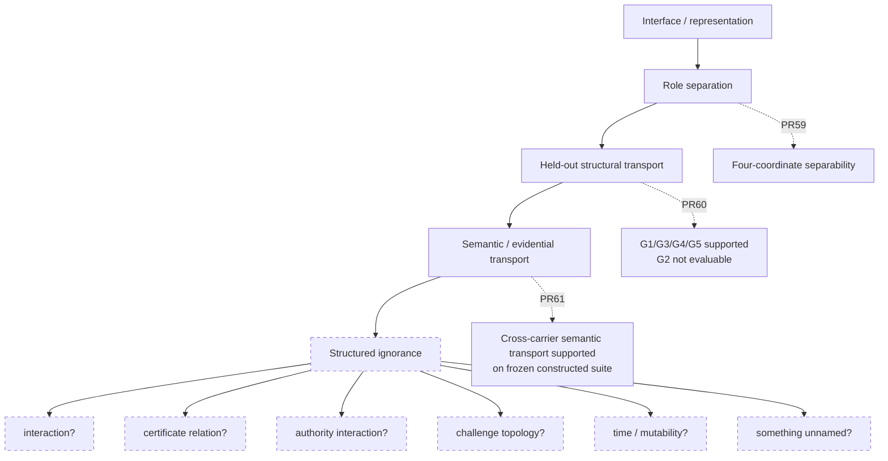

# SSI Research Map

> **Navigation only.** This file explains how the repository fits together; it does not supersede frozen scientific artifacts, result ledgers, or their provenance.

SSI is easier to read as a graph of research questions than as a chronological file tree. The major tracks below ask different questions and carry different authority.

---

## 1. Current earned frontier



The post-PR61 frontier is deliberately **unconstituted**. The current constraint is:

```text
LOCAL_PRESERVATION_TO_PATH_PRESERVATION = NOT_ESTABLISHED
```

with the non-rule:

```text
Legit(T1) AND Legit(T2) !=> Legit(T2 ∘ T1)
```

This does not authorize a composition experiment or identify composition as the missing object.

---

## 2. Transition / relicense ladder

The most recent research sequence lives in [`research/relicense/`](research/relicense/).

| Layer | Directory | Question | Current bounded state |
|---|---|---|---|
| Interaction representation | [`interaction_interface_v0_1`](research/relicense/interaction_interface_v0_1/) | Can higher-order interaction distinctions be represented when the local quotient collapses them? | pair identifiability supported on frozen constructed suite |
| Independent detection | [`interaction_detection_v0_1`](research/relicense/interaction_detection_v0_1/) | Can an independently constituted channel discriminate interaction states that local derivatives cannot? | independent higher-order detection supported on frozen constructed suite |
| Detection stress | [`interaction_detection_stress_v0_1`](research/relicense/interaction_detection_stress_v0_1/) | Does detection survive held-out world/channel/coverage/failure/conflict stress? | mixed typed result; semantic-binding boundary exposed |
| Semantic binding | [`interaction_semantic_binding_v0_1`](research/relicense/interaction_semantic_binding_v0_1/) | Does the observation relation actually constitute the target predicate? | first negative preserved; provenance-backed equivalence blocked by representation mismatch |
| Factored evidence interface | [`interaction_factored_evidence_interface_v0_1`](research/relicense/interaction_factored_evidence_interface_v0_1/) | Can relation identity and provenance remain separately addressable? | prospective representation experiment lineage |
| Transition role separation | [`transition_interface_separability_v0_1`](research/relicense/transition_interface_separability_v0_1/) | Can `S`, `L`, `V`, `Lambda` remain separately identifiable? | **supported on frozen constructed suite** |
| Held-out structural transport | [`transition_interface_separability_heldout_stress_v0_1`](research/relicense/transition_interface_separability_heldout_stress_v0_1/) | Does the factorization survive unfamiliar realizations? | G1/G3/G4/G5 supported; G2 **not evaluable under frozen binding** |
| Semantic / evidential transport | [`transition_semantic_transport_v0_1`](research/relicense/transition_semantic_transport_v0_1/) | Can constituted meaning cross new carriers without manufacturing evidence status? | **supported on frozen constructed cross-carrier suite** |

Also relevant: [`transport_witness_v0_1`](research/relicense/transport_witness_v0_1/) records the earlier composed-boundary witness gap that motivates caution about local-to-path inference.

---

## 3. What PR59–61 actually establish

### PR59 — separation

```text
FOUR_COORDINATE_TRANSITION_INTERFACE_SEPARABILITY
    = SUPPORTED_ON_FROZEN_CONSTRUCTED_SUITE
```

The object is:

```text
K = (S, L, V, Lambda)
```

The result supports separate representation and recovery of state, response law, validity/applicability, and authority on the frozen constructed geometry. It does not establish that these four coordinates are complete for transition governance.

### PR60 — held-out structural transport

```text
G1 world novelty          = SUPPORTED
G2 observation channel    = NOT_EVALUABLE_UNDER_FROZEN_BINDING
G3 coverage degradation   = SUPPORTED
G4 failure structure      = SUPPORTED
G5 conflicting channels   = SUPPORTED
```

The central lesson is typed:

```text
complete novel semantics + outside frozen input contract
    -> NOT_EVALUABLE_UNDER_FROZEN_BINDING
```

not `NOT_SUPPORTED`.

### PR61 — semantic / evidential transport

The experiment freezes five obligations plus a hard role firewall:

```text
ST-A1 semantic identity preservation
ST-A2 semantic separation
ST-A3 evidence-type legitimacy
ST-A4 provenance factor separation / recoverability
ST-A5 uncertainty preservation
ROLE_PRESERVATION_FIREWALL
```

All were supported on their frozen constructed scopes. The admission surface matched the independent oracle across all 44 cases:

```text
24 ADMIT + 12 REJECT + 8 UNRESOLVED = 44/44
```

The strongest earned promotion is:

```text
TRANSITION_SEMANTIC_TRANSPORT
    = SUPPORTED_ON_FROZEN_CONSTRUCTED_CROSS_CARRIER_SUITE
```

---

## 4. The older semantic-constitution track

[`research/semantic_constitution/`](research/semantic_constitution/) contains the lineage that asks how semantic identity is constituted and transported across regimes.

Useful entry points:

- [`README.md`](research/semantic_constitution/README.md)
- [`BOTTLENECK_HISTORY.md`](research/semantic_constitution/BOTTLENECK_HISTORY.md)
- [`V1_V8_RECONSTRUCTED_HANDOFF.md`](research/semantic_constitution/V1_V8_RECONSTRUCTED_HANDOFF.md)
- [`phase_v/PHASE_V_SEMANTIC_EQUIVALENCE.md`](research/semantic_constitution/phase_v/PHASE_V_SEMANTIC_EQUIVALENCE.md)
- [`phase_v/CROSS_REGIME_TRANSPORT_CONTRACT.md`](research/semantic_constitution/phase_v/CROSS_REGIME_TRANSPORT_CONTRACT.md)

This lineage is conceptually adjacent to PR61 but is not silently merged into it. Each object retains its own evidence and authority scope.

---

## 5. SSI-CALC

[`research/ssi_calc/`](research/ssi_calc/) contains executable checker/compiler research.

Current governing boundary:

```text
SSI_CALC_KERNEL_DELTA = 0
```

The current frozen checker work supports bounded decision-level generalization in its own held-out suites, but does not establish universal soundness, niche advantage, or authority to absorb newer transition/relicense concepts into the kernel.

Important areas:

- [`v0_1/`](research/ssi_calc/v0_1/) — checker, benchmark, held-out/fresh suites.
- [`compiler/k0/`](research/ssi_calc/compiler/k0/) — K0 source/compiler/audit freeze.
- [`compiler/k1/`](research/ssi_calc/compiler/k1/) — K1 source/compiler/audit and runtime semantic ABI.
- [`representation_audit/v0_1/`](research/ssi_calc/representation_audit/v0_1/) — representation audit.

Conceptual relevance does not constitute kernel authority.

---

## 6. Empirical benchmark lineage

[`empirical/`](empirical/) contains earlier benchmark work on interface insufficiency, quotient construction, authorization, and adversarial attacks.

Useful routes:

- [`empirical/README.md`](empirical/README.md)
- [`benchmark_v0_1/`](empirical/benchmark_v0_1/)
- [`benchmark_v0_2/`](empirical/benchmark_v0_2/)
- [`benchmark_v0_2_quotient/`](empirical/benchmark_v0_2_quotient/)
- [`benchmarks/V0X_LINEAGE.md`](benchmarks/V0X_LINEAGE.md)

These lineages supply important historical distinctions, but later relicense experiments do not retroactively rewrite their frozen outcomes.

---

## 7. Energy / corrective economy

[`energy/`](energy/) studies whether adaptive correction can improve future viability while accounting for execution and measurement costs.

Start with:

- [`energy/README.md`](energy/README.md)
- [`energy/EVIDENCE_LEDGER.md`](energy/EVIDENCE_LEDGER.md)
- [`energy/LINEAGE_CORRECTIVE_ECONOMY.md`](energy/LINEAGE_CORRECTIVE_ECONOMY.md)
- [`energy/experiments/`](energy/experiments/)

This is a separate empirical axis from semantic/relicense authority.

---

## 8. Retrospective and theory

- [`retrospective/LOCALIZATION_CALCULUS.md`](retrospective/LOCALIZATION_CALCULUS.md) — failure-localization discipline.
- [`theory/FUTURE_SAFE_OPTION_STRUCTURE.md`](theory/FUTURE_SAFE_OPTION_STRUCTURE.md) — prospective theory / option structure.
- [`ARCHITECTURE.md`](ARCHITECTURE.md) — broad conceptual architecture.

Treat theory candidates as candidates unless a frozen result explicitly promotes them.

---

## 9. Authority map

The repository distinguishes at least four kinds of statements:

| Type | Meaning | Example |
|---|---|---|
| **Frozen empirical result** | supported/failed on a specified frozen suite | PR61 semantic transport result |
| **Formal countermodel / formal candidate** | formal relation established under a frozen formal object | F4/F5 lineage |
| **Architectural candidate** | useful compression motivated by evidence, not theorem | `LEGITIMATE_TRANSPORT_NON_AMPLIFICATION` |
| **Prospective frontier** | deliberately not constituted | post-PR61 `?` |

Never upgrade one category into another by prose alone.

---

## 10. Core non-rules to carry across tracks

```text
Can != May != Did
validity != transportability != composability
information != admissible evidence
information transport != semantic transport
semantic equivalence != evidence-type admission
unproven != revoked
not evaluable != failed
correct output != legitimate selection process
role license != execution license
local preservation != path preservation
```

These are useful routing constraints. Their exact authority still depends on the object and scope in which each was frozen or supported.

---

## 11. Reader rule

> **Do not infer authority from recency. Infer authority from provenance, frozen dependency order, and the exact claim scope.**

If this map conflicts with a frozen experiment artifact, the frozen artifact governs.
