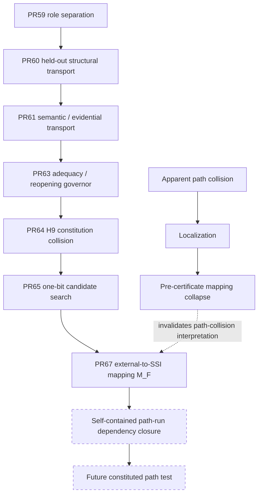

# SSI Research Map

> **Navigation only.** Frozen experiment artifacts, exact first results, and their provenance remain authoritative.

For the exact current stop, see [`research/CURRENT_FRONTIER.md`](research/CURRENT_FRONTIER.md).

---

## 1. Current frontier graph



The current stop is at `H`: the complete path-run dependency closure is **not yet constituted**.

The old post-PR61 question remains scientifically live, but the first attempted path witness did not reach it.

---

## 2. Transition / relicense ladder

The active sequence lives mainly in [`research/relicense/`](research/relicense/).

| Layer | Directory / object | Question | Current bounded state |
|---|---|---|---|
| Interaction representation | `interaction_interface_v0_1` | Can higher-order interaction distinctions be represented? | pair identifiability supported on frozen constructed suite |
| Independent detection | `interaction_detection_v0_1` | Can an independent channel discriminate states collapsed locally? | supported on frozen constructed suite |
| Detection stress | `interaction_detection_stress_v0_1` | Does detection survive held-out stress? | mixed typed result; binding boundary exposed |
| Semantic binding | `interaction_semantic_binding_v0_1` | Does the relation constitute the target predicate? | first negative preserved; provenance/representation problem localized |
| Factored evidence | `interaction_factored_evidence_interface_v0_1` | Can relation identity and provenance remain separate? | bounded prospective/experimental lineage |
| PR59 | `transition_interface_separability_v0_1` | Can `S,L,V,Lambda` remain separately identifiable? | **supported on frozen constructed suite** |
| PR60 | `transition_interface_separability_heldout_stress_v0_1` | Does the factorization survive unfamiliar realizations? | G1/G3/G4/G5 supported; G2 **not evaluable** |
| PR61 | `transition_semantic_transport_v0_1` | Can constituted meaning cross changed carriers without evidence laundering? | **supported on frozen constructed cross-carrier suite** |
| PR63 | adequacy governor | When has a frozen representation earned local reopening? | three-valued governor; only inadequacy licenses local search |
| PR64 | H9 hostile case | Can positive adequacy be distinguished from caller assertion? | **constitution nonidentifiability supported in H9** |
| PR65 | one-bit candidate search | Does any plausible one-bit repair reproduce the frozen neighborhood? | **NO_EXACT_CANDIDATE** |
| PR67 | `external_to_ssi_mapping_v0_1` | Can external transition records be mapped into SSI-local inputs without silent collapse or backward-flow leakage? | **12/12 mapper-only suite; branch-local draft** |

---

## 3. The path-collision correction

The path-level target remains:

```text
Psi_F(P_A) == Psi_F(P_B)
AND
Y_path(P_A) != Y_path(P_B)
```

but the first constructed witness did not establish it as a property of the frozen SSI representation.

Localization showed:

```text
E(P_A) != E(P_B)
    -> mapper constructed equivalent SSI inputs
    -> I_F(P_A) == I_F(P_B)
    -> Psi_F(P_A) == Psi_F(P_B)
```

The external distinction disappeared before certification. Therefore:

```text
PRE_CERTIFICATE_MAPPING_COLLAPSE = ESTABLISHED_FOR_THAT_ATTEMPT
PATH_LEVEL_SSI_INADEQUACY        = NOT_ESTABLISHED
CERTIFICATE_PROJECTION_LOSS      = NOT_TESTED
RELATIONAL_COMPOSITION_FAILURE   = NOT_TESTED
```

This is why PR67 exists.

---

## 4. PR67: constituted mapping boundary

PR67 freezes:

```text
M_F : E(T) -> I_F(T)
```

with four explicit dispositions:

```text
PRESERVE
NORMALIZE
EXCLUDE_WITH_BASIS
NOT_EVALUABLE
```

and the nonrule:

```text
excluded from I_F != irrelevant to Y_path
```

Unknown information fails closed. Unconstituted path relations become `NOT_EVALUABLE`. Downstream consequence/certificate/collision information is rejected by a backward-flow firewall.

The mapper is applied independently to each transition. Equality of mapped A/B inputs is therefore a result, not an experimental premise.

---

## 5. Reproducibility / dependency closure

The next path run depends on a complete set:

```text
D_R = {
    M_F,
    P_A,
    P_B,
    independent Y_path evaluator,
    one-shot runner,
    freeze manifest,
    exact SSI dependencies
}
```

For every `d` in `D_R`:

```text
identified(d)
AND immutable(d)
AND resolvable_by_executor(d)
```

must hold before execution.

The current next object is therefore not a theory object but an experimental package:

```text
SELF_CONTAINED_PATH_RUN_DEPENDENCY_BUNDLE
```

Current status:

```text
COMPLETE_PATH_RUN_BUNDLE = NOT_CONSTITUTED
PATH_RUN_AFTER_M_F       = NOT_EXECUTED
```

---

## 6. PR59–61 empirical spine

### PR59

```text
K = (S, L, V, Lambda)

FOUR_COORDINATE_TRANSITION_INTERFACE_SEPARABILITY
    = SUPPORTED_ON_FROZEN_CONSTRUCTED_SUITE
```

This does not establish coordinate completeness.

### PR60

```text
G1 world novelty        = SUPPORTED
G2 observation channel  = NOT_EVALUABLE_UNDER_FROZEN_BINDING
G3 coverage degradation = SUPPORTED
G4 failure structure    = SUPPORTED
G5 conflicting channels = SUPPORTED
```

### PR61

```text
TRANSITION_SEMANTIC_TRANSPORT
    = SUPPORTED_ON_FROZEN_CONSTRUCTED_CROSS_CARRIER_SUITE
```

The key surviving boundary is still:

```text
local preservation != path preservation
```

but no composition failure has yet been established.

---

## 7. PR63–65 adequacy-governor spine

### PR63

```text
SUPPORTED_ADEQUATE_ON_TESTED_SCOPE
UNKNOWN
INADEQUATE
```

`NOT_EVALUABLE` remains separate. Only `INADEQUATE` opens local search.

### PR64 / H9

```text
coverage assertion != coverage warrant
```

is supported as a local constitution failure on the frozen H9 scope.

### PR65

```text
NO_EXACT_CANDIDATE
```

for five frozen one-bit candidates. `C1 AND C4` is an exact extensional fit on the frozen ten-world ledger only; it is not an identified mechanism or licensed repair.

---

## 8. SSI-CALC

[`research/ssi_calc/`](research/ssi_calc/) remains a separate frozen executable lineage.

```text
SSI_CALC_KERNEL_DELTA = 0
```

No current relicense result authorizes a new SSI-CALC rule or coordinate.

---

## 9. Older / adjacent tracks

- [`research/semantic_constitution/`](research/semantic_constitution/) — semantic identity and cross-regime transport lineage.
- [`empirical/`](empirical/) — interface/quotient/authorization benchmark lineage.
- [`benchmarks/`](benchmarks/) — benchmark history and V0.x lineage.
- [`energy/`](energy/) — corrective-economy / viability-cost experiments.
- [`retrospective/LOCALIZATION_CALCULUS.md`](retrospective/LOCALIZATION_CALCULUS.md) — failure-localization discipline.
- [`theory/`](theory/) — prospective theoretical objects; not automatically empirical claims.

---

## 10. Authority map

| Type | Meaning | Example |
|---|---|---|
| Frozen empirical result | Result on an exact constituted suite | PR61 semantic transport |
| Frozen negative result | Preserved failure / no-fit result | PR65 `NO_EXACT_CANDIDATE` |
| Local collision / inadequacy witness | Independently constituted nonidentifiability on a frozen interface | PR64 H9 |
| Mapping constitution | Tested external-to-interface mapping contract | PR67 `M_F` |
| Workflow/reproducibility constraint | Controls whether an experiment is evaluable | dependency closure requirement |
| Prospective theory | Useful candidate not established as empirical primitive | composition / future challengeability candidates |

Never upgrade one category into another by prose alone.

---

## 11. Core non-rules

```text
Can != May != Did
validity != transportability != composability
information != admissible evidence
semantic identity != evidence admission
unproven != revoked
not evaluable != failed
local preservation != path preservation
excluded from local input != globally irrelevant
research-state assertion != reproducibly accessible artifact
```

---

## 12. Reader rule

> **Do not infer authority from recency. Infer authority from provenance, frozen dependency order, and exact claim scope.**

If this map conflicts with a frozen experiment artifact, the frozen artifact governs.
