# Relicense / Transition Research

> **Human index only.** Frozen experiment artifacts inside this directory remain the scientific authority sources.

This directory contains SSI work on interaction interfaces, warrant transport, semantic binding, transition-role separation, adequacy governance, and external-to-SSI mapping.

For the exact current stop, see [`../CURRENT_FRONTIER.md`](../CURRENT_FRONTIER.md).

---

## Current ladder

```mermaid
flowchart LR
    A[Interaction representation] --> B[Independent detection]
    B --> C[Held-out detection stress]
    C --> D[Semantic binding]
    D --> E[Factored evidence]
    E --> F[PR59 role separation]
    F --> G[PR60 held-out structural transport]
    G --> H[PR61 semantic / evidential transport]
    H --> I[PR63 adequacy governor]
    I --> J[PR64 H9 constitution collision]
    J --> K[PR65 one-bit candidate search]
    K --> L[PR67 external-to-SSI mapping M_F]
    L --> M[Dependency closure]
    M --> N[Future constituted path test]

    style M stroke-dasharray: 5 5
    style N stroke-dasharray: 5 5
```



The current stop is dependency closure, not composition theory.

---

## PR59 — transition interface separability

[`transition_interface_separability_v0_1/`](transition_interface_separability_v0_1/)

Target:

```text
K = (S, L, V, Lambda)
```

Frozen bounded result:

```text
FOUR_COORDINATE_TRANSITION_INTERFACE_SEPARABILITY
    = SUPPORTED_ON_FROZEN_CONSTRUCTED_SUITE
```

Completeness, general composition, and authority transfer remain unestablished.

---

## PR60 — held-out transition separability stress

[`transition_interface_separability_heldout_stress_v0_1/`](transition_interface_separability_heldout_stress_v0_1/)

Frozen typed vector:

```text
G1 world novelty          = SUPPORTED
G2 observation channel    = NOT_EVALUABLE_UNDER_FROZEN_BINDING
G3 coverage degradation   = SUPPORTED
G4 failure structure      = SUPPORTED
G5 conflicting channels   = SUPPORTED
```

Critical rule:

```text
information exists != frozen interface is entitled to consume it
```

---

## PR61 — transition semantic transport

[`transition_semantic_transport_v0_1/`](transition_semantic_transport_v0_1/)

Core decomposition:

```text
carrier != semantic object != evidence type != provenance
```

Strongest frozen result:

```text
TRANSITION_SEMANTIC_TRANSPORT
    = SUPPORTED_ON_FROZEN_CONSTRUCTED_CROSS_CARRIER_SUITE
```

The nonrule remains:

```text
local preservation != path preservation
```

but this does not establish a path-composition defect.

---

## PR63 — adequacy / reopening governor

The adequacy governor is deliberately narrow:

```text
SUPPORTED_ADEQUATE_ON_TESTED_SCOPE
UNKNOWN
INADEQUATE
```

with `NOT_EVALUABLE` separate. Only `INADEQUATE` yields local search permission.

It does not generate repairs, infer coordinates, modify the frozen representation, or change SSI-CALC.

---

## PR64 — H9 constitution collision

The hostile suite preserved its first 8/10 result.

H9 supports, on its frozen scope:

```text
coverage assertion != coverage warrant
```

The positive-adequacy interface could not distinguish independently constituted coverage from caller assertion.

This is a local constitution/interface inadequacy witness, not a general theory of coverage.

---

## PR65 — one-bit candidate search

Five frozen one-bit candidates were tested against the ten-world H9 neighborhood.

Result:

```text
NO_EXACT_CANDIDATE
exact_candidates = []
repair_permitted = false
new_ssi_coordinate_established = false
SSI_CALC_KERNEL_DELTA = 0
```

`C1 AND C4` exactly fits the frozen ledger extensionally, but sufficiency and mechanism remain unestablished.

---

## Path attack: first apparent collision and correction

A later constructed path attempt appeared to satisfy:

```text
Psi_F(P_A) == Psi_F(P_B)
AND
Y_path(P_A) != Y_path(P_B)
```

Localization showed that the external paths were collapsed while constructing SSI-local cases, before the certificate boundary.

Therefore:

```text
PRE_CERTIFICATE_MAPPING_COLLAPSE = ESTABLISHED_FOR_THAT_ATTEMPT
PATH_LEVEL_SSI_INADEQUACY        = NOT_ESTABLISHED
CERTIFICATE_PROJECTION_LOSS      = NOT_TESTED
RELATIONAL_COMPOSITION_FAILURE   = NOT_TESTED
```

The lesson is procedural:

> **Constitute the witness at every interface it is supposed to falsify.**

---

## PR67 — external-to-SSI mapping contract

[`external_to_ssi_mapping_v0_1/`](external_to_ssi_mapping_v0_1/)

PR67 freezes:

```text
M_F : E(T) -> I_F(T)
```

with explicit dispositions:

```text
PRESERVE
NORMALIZE
EXCLUDE_WITH_BASIS
NOT_EVALUABLE
```

The mapper may not inspect downstream path consequences, certificate outputs, path outputs, collision expectations, or desired diagnoses.

Important nonrules:

```text
excluded from I_F != globally irrelevant
unknown field != safe to drop
unmappable != irrelevant
A/B local-input equality = derived result only
```

Frozen mapper-only first result:

```text
12 / 12 obligations passed
```

Strongest branch-local result:

```text
EXTERNAL_TO_SSI_MAPPING_CONSTITUTION
    = SUPPORTED_ON_FROZEN_ABSTRACT_MAPPING_SUITE
```

PR67 remains a draft / branch-local object until merged through normal repository review.

---

## Current boundary: complete dependency closure

The next path run requires a self-contained dependency set:

```text
D_R = {
    M_F,
    P_A,
    P_B,
    independent Y_path evaluator,
    one-shot runner,
    freeze manifest,
    exact SSI dependencies
}
```

Every dependency must be:

```text
identified
AND immutable
AND resolvable by the executor
```

Current status:

```text
COMPLETE_PATH_RUN_BUNDLE = NOT_CONSTITUTED
PATH_RUN_AFTER_M_F       = NOT_EXECUTED
```

No path result should be issued from a runner that cannot resolve the exact frozen dependency closure.

A failed run caused by unresolved artifacts is `NOT_EVALUABLE`, not a scientific negative.

---

## How to inspect an experiment

Prefer the exact frozen dependency order:

```text
SPEC
-> CASES
-> BINDINGS / CANDIDATE
-> independent ORACLE
-> PROTOCOL
-> EVALUATOR / RUNNER
-> FIRST RESULT
```

For multi-interface experiments, also verify that each upstream mapping is independently constituted rather than manually forcing the downstream representation.

For externally executed experiments, verify dependency closure:

```text
artifact identity
+ artifact immutability
+ artifact resolvability
```

---

## Governing non-rules

```text
validity != transportability != composability
information != admissible evidence
semantic identity != evidence admission
not evaluable != failed
unproven != revoked
local preservation != path preservation
same certificate != certificate projection loss
same certificate history != composition insufficiency
excluded from local input != globally irrelevant
research-state assertion != reproducibly accessible artifact
```

---

## Current authority ceiling

```text
PATH_LEVEL_SSI_INADEQUACY        = NOT_ESTABLISHED
CERTIFICATE_PROJECTION_LOSS      = NOT_TESTED
RELATIONAL_COMPOSITION_FAILURE   = NOT_TESTED
INTERFACE_AUTHORITY_BOUNDARY     = UNKNOWN
COMPOSITION_INSUFFICIENCY        = NOT_ESTABLISHED
COMPOSITION_THEOREM              = NOT_EARNED
NEW_RELATION                     = NOT_EARNED
NEW_COORDINATE                   = NOT_EARNED
REPAIR                           = NOT_EARNED
SSI_CALC_KERNEL_DELTA            = 0
```

---

## Navigation

- Current exact frontier: [`../CURRENT_FRONTIER.md`](../CURRENT_FRONTIER.md)
- Repository front door: [`../../README.md`](../../README.md)
- Full topology: [`../../RESEARCH_MAP.md`](../../RESEARCH_MAP.md)
- Status board: [`../../REPOSITORY_STATUS.md`](../../REPOSITORY_STATUS.md)
- Synthesis: [`../SSI_BIG_PICTURE.md`](../SSI_BIG_PICTURE.md)

If this index conflicts with a frozen experiment artifact, the frozen artifact governs.
