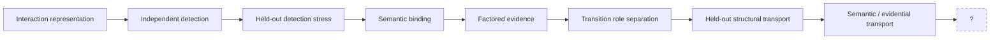

# Relicense / Transition Research

> **Human index only.** Frozen experiment artifacts inside this directory remain the scientific authority sources.

This directory contains the SSI work on interaction interfaces, warrant transport, semantic binding, transition-role separation, and cross-carrier semantic/evidential transport.

The unifying question is not simply whether a system can compute a result. It is whether the evidence, semantic object, role, and authority required for a transformation are actually constituted at the boundary where that transformation is used.

---

## Current ladder



The post-transport `?` is intentionally unconstituted.

---

## Experiments

### 1. Interaction interface

[`interaction_interface_v0_1/`](interaction_interface_v0_1/)

Prospective higher-order interface:

```text
Phi_int = (
  boundary_path,
  local_certificate_refs,
  interaction_scope,
  interaction_facts,
  observation_coverage,
  provenance,
  challenge_record
)
```

Bounded result: pair identifiability supported on the frozen constructed suite. This is interface correction after diagnosis, not blind interface invention.

---

### 2. Independent interaction detection

[`interaction_detection_v0_1/`](interaction_detection_v0_1/)

Tests whether a channel independently constituted relative to the frozen local quotient can discriminate higher-order interaction states that local derivatives cannot.

Bounded result: independent higher-order detection supported on the frozen constructed suite.

Non-rule:

```text
detection supported != witness sufficiency
```

---

### 3. Held-out interaction detection stress

[`interaction_detection_stress_v0_1/`](interaction_detection_stress_v0_1/)

Stress axes include world novelty, channel novelty, coverage degradation, failure-structure novelty, and independent contradiction.

The mixed result preserves a critical boundary:

```text
information preservation != semantic preservation
```

Novel semantic carriers cannot be converted into answers or legacy evidence merely because the information is available.

---

### 4. Semantic binding

[`interaction_semantic_binding_v0_1/`](interaction_semantic_binding_v0_1/)

Asks whether a source relation actually constitutes the target predicate.

This experiment preserves its first negative result: positive provenance-backed equivalence was blocked by a protocol/evaluator representation mismatch rather than silently repaired.

Key diagnosis:

```text
RELATION_PROVENANCE_COLLAPSE
INTERFACE_NONIDENTIFIABILITY_VIA_COORDINATE_CONFLATION
```

The resulting prospective repair direction was to factor relation identity and provenance.

---

### 5. Factored evidence interface

[`interaction_factored_evidence_interface_v0_1/`](interaction_factored_evidence_interface_v0_1/)

Candidate representation:

```text
e = (r_P, pi_r)
```

The key design constraint is:

```text
relation identity != provenance identity
```

with relevant separation, orthogonal invariance, and provenance recoverability treated as distinct obligations.

---

### 6. Transport witness

[`transport_witness_v0_1/`](transport_witness_v0_1/)

Earlier transport-witness work exposed a higher-order problem: locally preserved boundary witnesses did not automatically determine the status of a longer composed crossing.

Important non-rule:

```text
local warrant preservation != composed warrant preservation
```

This lineage motivates caution after PR61 but does not by itself identify the post-PR61 frontier.

---

### 7. Transition interface separability — PR59

[`transition_interface_separability_v0_1/`](transition_interface_separability_v0_1/)

Target object:

```text
K = (S, L, V, Lambda)
```

where state, response law, validity/applicability, and authority remain independently addressable.

Frozen bounded result:

```text
FOUR_COORDINATE_TRANSITION_INTERFACE_SEPARABILITY
    = SUPPORTED_ON_FROZEN_CONSTRUCTED_SUITE
```

The constructed suite supports relevant separation, orthogonal invariance, coordinate recoverability, uncertainty preservation, and multi-coordinate identifiability.

Not established:

```text
four-coordinate completeness
real-world boundary generalization
boundary semantics
repair authority
formal transition calculus
```

---

### 8. Held-out transition separability stress — PR60

[`transition_interface_separability_heldout_stress_v0_1/`](transition_interface_separability_heldout_stress_v0_1/)

Tests whether the PR59 factorization survives unfamiliar stress geometry without changing the inherited binding.

Frozen result vector:

```text
G1 world novelty          = SUPPORTED
G2 observation channel    = NOT_EVALUABLE_UNDER_FROZEN_BINDING
G3 coverage degradation   = SUPPORTED
G4 failure structure      = SUPPORTED
G5 conflicting channels   = SUPPORTED
```

Critical boundary:

```text
complete semantics exist
AND
carrier is outside frozen input contract

=> NOT_EVALUABLE_UNDER_FROZEN_BINDING
```

not a separability failure.

---

### 9. Transition semantic transport — PR61

[`transition_semantic_transport_v0_1/`](transition_semantic_transport_v0_1/)

Opens a new, separately constituted bridge rather than repairing PR60's inherited binding.

Core decomposition:

```text
carrier != semantic object != evidence type != provenance
```

The 44-case suite tests:

```text
ST-A1 semantic identity preservation
ST-A2 semantic separation
ST-A3 evidence-type legitimacy
ST-A4 provenance factor separation / recoverability
ST-A5 uncertainty preservation
ROLE_PRESERVATION_FIREWALL
```

All frozen obligations were supported on their stated constructed scopes.

Strongest earned result:

```text
TRANSITION_SEMANTIC_TRANSPORT
    = SUPPORTED_ON_FROZEN_CONSTRUCTED_CROSS_CARRIER_SUITE
```

Key empirical distinction:

```text
recovered meaning != entitlement to call it evidence
```

Provenance-sensitive rejection can change admission without changing semantic identity; partial/conflicted sources remain non-complete; high-confidence predictions remain non-observations; role-looking fields do not manufacture role identity.

---

## Current boundary

The sequence currently stops here:

```text
role separation
-> held-out structural transport
-> semantic / evidential transport
-> ?
```

The blank is structured ignorance.

Current non-rule:

```text
Legit(T1) AND Legit(T2) !=> Legit(T2 ∘ T1)
```

Current broader boundary:

```text
local preservation != path preservation
```

Prospective possibilities such as transformation composition, certificate composition, authority composition, challenge-path preservation, and mutability remain **NOT OPENED**. None is designated as the next research object.

---

## How to inspect an experiment

Prefer the experiment's frozen dependency order. A common pattern is:

```text
SPEC
-> CASES
-> BINDINGS
-> ORACLE
-> PROTOCOL
-> EVALUATOR
-> RESULT
```

Do not infer authority from filename date or Git recency alone.

If an experiment preserves a failed first result and later opens a repair lineage, both are part of the evidence.

---

## Governing non-rules

```text
validity != transportability != composability
information != admissible evidence
semantic identity != evidence admission
semantic equivalence != provenance equivalence
not evaluable != failed
unproven != revoked
role license != execution license
local preservation != path preservation
```

The exact scope of each statement still depends on the experiment that earned or motivated it.

---

## Navigation

- Repository front door: [`../../README.md`](../../README.md)
- Full research topology: [`../../RESEARCH_MAP.md`](../../RESEARCH_MAP.md)
- Current status board: [`../../REPOSITORY_STATUS.md`](../../REPOSITORY_STATUS.md)
- Contribution / freeze protocol: [`../../CONTRIBUTING.md`](../../CONTRIBUTING.md)

If this index conflicts with a frozen experiment artifact, the frozen artifact governs.
