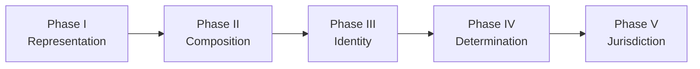

# SSI Bottleneck History

Status snapshot: 2026-08-16.

> **The bottleneck repeatedly moved upstream as each attempted solution exposed a deeper prerequisite.**

The twenty-stage semantic lineage is easier to understand as five phase transitions:

\[
\boxed{
\text{representation}
\rightarrow
\text{composition}
\rightarrow
\text{identity}
\rightarrow
\text{determination}
\rightarrow
\text{jurisdiction}.
}
\]

The deeper invariant across all five phases is:

\[
\boxed{
X\text{ is available}
\not\Rightarrow
X\text{ has authority for operation }Y.
}
\]

The history is therefore not simply a sequence of increasingly sophisticated objects. It is a sequence of **authority leaks caught earlier and earlier in the causal chain**.

---

## Five phases



| Phase | Core question | Characteristic failure |
|---|---|---|
| **I — Representation** | Can the intended target be constituted and observed coherently? | missing referents, semantic type errors, observational collapse |
| **II — Composition** | Do local semantic guarantees survive joint use? | joint oracle leakage, consumer non-congruence, ungrounded safety predicates |
| **III — Identity** | What makes two composed semantic objects the same? | component identity mistaken for composition identity; identity primitive declared but ungrounded |
| **IV — Determination** | What identity/equivalence claims actually follow from supplied semantics? | multiple admissible extensions; semantic richness without identity authority |
| **V — Jurisdiction** | Which external semantics may enter, and what operations may consume them? | over-admission, under-admission, unlicensed transfer across semantic purposes |

---

# Phase I — Representation

## 1. V0.1 — Observation

**Bottleneck:** can the observation operator distinguish the semantic target?

\[
O(x)=O(y)
\quad\text{while}\quad
T(x)\neq T(y).
\]

**Failure:** observational non-identifiability.

**Lesson:**

\[
\boxed{
\text{measurement cannot repair a collapsed target distinction}.
}
\]

This was the original interface problem: if target-changing information never enters \(O\), no estimator over \(O\) can recover it.

---

## 2. Semantic Candidate 0 — Referent completeness

**Bottleneck:** what exactly are the things being compared?

The nominal target still depended on undeclared objects and relations.

**Failure:** semantic under-identification.

**Lesson:**

\[
\boxed{
\text{a target formula is not closed merely because its main variables are named}.
}
\]

The bottleneck moved from measurement quality to semantic referent quality.

---

## 3. V1 — Static semantic closure

**Bottleneck:** is the declared semantic graph formally closed?

The decisive circular dependency was:

\[
T
\rightarrow D
\rightarrow Q_H
\rightarrow
\mathcal S_{\rm control}
\rightarrow T.
\]

**Failure:** `SEMANTIC_TYPE_ERROR`.

**Lesson:**

\[
\boxed{
\text{semantic domain constitution must precede target evaluation}.
}
\]

---

## 4. V2 — Semantic adequacy

**Bottleneck:** is a formally closed ontology actually semantically adequate?

V2 passed closure and then failed hostile semantic attack.

Two decisive witnesses were:

\[
\boxed{
\text{evidence equivalence}
\not\Rightarrow
\text{substitutability}
}
\]

and:

\[
\boxed{
\text{ground truth may grade }H
\neq
\text{ground truth may inform }H.
}
\]

**Failure:** `SEMANTIC_NOT_IDENTIFIED`.

**Lesson:**

\[
\boxed{
\text{closure}\neq\text{adequacy}.
}
\]

This is the first clear instance of the later authority-leak pattern: information may exist without being licensed for a particular consumer.

---

# Phase II — Composition

## 5. V3 — Repair machinery itself

**Bottleneck:** can the new substitution and information semantics themselves satisfy the discipline they were introduced to enforce?

**Failure:** unresolved information types, missing licensed-input relations, and a direct interface contradiction.

**Lesson:**

\[
\boxed{
\text{a mechanism introduced to enforce semantic discipline acquires no authority until it obeys the same discipline}.
}
\]

---

## 6. V4 — Compositional safety

**Bottleneck:** is local semantic safety preserved under composition?

Two hostile witnesses:

\[
\boxed{
\text{individually non-oracular}
\not\Rightarrow
\text{jointly non-oracular}
}
\]

and:

\[
\boxed{
\text{licensed substitution}
\not\Rightarrow
\text{consumer congruence}.
}
\]

**Lesson:**

\[
\boxed{
\text{semantic guarantees must be composition-safe}.
}
\]

The secret-sharing witness made the point sharply: two inputs can each be individually safe while jointly revealing exactly what neither may reveal alone.

---

## 7. V5 — Grounding the guarantee

**Bottleneck:** can composition safety be defined without merely naming it?

`JNO_H` was well-typed but arbitrary: two semantic models could agree on the upstream facts while assigning opposite truth values to the predicate.

**Failure:** ungrounded joint non-oracularity.

**Lesson:**

\[
\boxed{
\text{fixed extension}\neq\text{grounded extension}.
}
\]

---

## 8. V6 — Compatibility grounding

**Bottleneck:** what independently determines whether an input tuple determines the answer?

Candidate:

\[
G(I)=1
\iff
\forall s_a,s_b\in\mathcal C(I),
\quad
\kappa(\delta_a)\equiv_{\mathcal P}\kappa(\delta_b).
\]

**Failure:** the tuple type, compatibility relation, and relevant identity relations were not themselves fully constituted.

**Lesson:**

\[
\boxed{
\text{a promising grounding idea still needs a closed identity domain}.
}
\]

---

## 9. V7 — Composition identity

**Bottleneck:** what does “the same input tuple” mean?

Componentwise identity failed because semantically constitutive structure could live in the relation among components:

\[
\boxed{
\text{component identity}
\not\Rightarrow
\text{composition identity}.
}
\]

**Failure:** compositional input identity collapse.

**Lesson:**

\[
\boxed{
\text{semantic structure can live in relations, not merely objects}.
}
\]

The bottleneck had now moved from composition safety to the identity conditions of the composed object itself.

---

# Phase III — Identity

## 10. V8.0–V8.1 — Identity itself

**Bottleneck:** what constitutes identity of the composed object?

A typed identity relation \(E_S\) was introduced.

Static closure succeeded.

Hostile attack showed:

\[
\boxed{
\text{declaring }E_S
\neq
\text{grounding }E_S.
}
\]

**Failure:** `UNGROUNDED_IDENTITY_RELATION`.

---

## 11. V8.2–V8.3 — Grounding identity

**Bottleneck:** can independent semantic facts force \(E_S\)?

A prior semantic signature, grounding facts, and model-comparison framework were introduced.

Yet two admissible models could agree on the prior semantic facts while disagreeing on identity:

\[
\boxed{
\text{same prior facts}
\not\Rightarrow
\text{same identity extension}.
}
\]

**Failure:** `SEMANTIC_NOT_IDENTIFIED`.

The model-theoretic question became explicit: is the identity extension determined on the admissible fiber of the prior semantics?

---

# Phase IV — Determination

## 12. V8.4 — Identity determination

The key object became:

\[
\operatorname{Ext}_{E_S}(A,T_S)
=
\left\{
E_S^M:
M\models T_S,\;
M|_{\Sigma_S^{\rm prior}}=A
\right\}.
\]

The original trichotomy was:

| \(|\operatorname{Ext}|\) | result |
|---:|---|
| \(0\) | `NO_ADMISSIBLE_IDENTITY` |
| \(1\) | `IDENTITY_DETERMINED` |
| \(>1\) | `SEMANTIC_NOT_IDENTIFIED` |

The important discovery was not a universal identity criterion.

It was:

\[
\boxed{
\text{SSI can audit identity authority but cannot manufacture the semantic authority that determines identity}.
}
\]

Later work refined this from a global cardinality test into pair-level partial identification.

---

## 13. E0 — Negative control

**Question:** can a legitimate semantic sort remain genuinely underdetermined?

Incidence-only edge semantics yielded:

\[
|\operatorname{Ext}|=2.
\]

**Result:** `SEMANTIC_NOT_IDENTIFIED`.

**Lesson:**

\[
\boxed{
\text{underdetermination can be a formal semantic result, not merely “we have not decided yet”}.
}
\]

---

## 14. E1 — Positive control

**Question:** can a different independently constituted semantic sort uniquely determine identity?

Endpoint-pair value semantics yielded:

\[
|\operatorname{Ext}|=1.
\]

**Result:** `IDENTITY_DETERMINED`.

**Lesson:**

\[
\boxed{
\text{determination machinery can recognize uniqueness when the supplied semantics genuinely force it}.
}
\]

E1 was a formal control, not validation of a universal identity theory.

---

## 15. E2-A — Rich relational semantics

**Question:** does richer transition/interface semantics automatically determine presentation identity?

Prior structure included:

\[
\operatorname{Step},
\qquad
\operatorname{Obs},
\qquad
\operatorname{Type}.
\]

But no cross-constraint linked those facts to \(E_S\).

Therefore:

\[
\boxed{
|\operatorname{Ext}_{E_S}|=15.
}
\]

**Result:** `SEMANTIC_NOT_IDENTIFIED`.

**Lessons:**

\[
\boxed{
\text{semantic richness}
\not\Rightarrow
\text{identity authority}
}
\]

and:

\[
\boxed{
\text{constituted distinction}
\not\Rightarrow
\text{identity constraint}.
}
\]

---

## 16. Recursion stop — Semantic authority boundary

Trying to ground the grounding relation recursively produced:

\[
C_d
\rightarrow
\text{why does }C_d\text{ have authority?}
\rightarrow
C_{d2}
\rightarrow\cdots
\]

The V8 universal identity-construction route was stopped.

**Boundary:**

\[
\boxed{
\textbf{SSI cannot originate semantic identity authority from within itself.}
}
\]

The architecture therefore shifted from identity construction to auditing externally supplied semantic regimes.

---

# Phase V — Jurisdiction

## 17. Identity-regime audit architecture

The new question became:

> Given an independently justified semantic regime, what identity claims actually follow from it?

The extension set was promoted from a failure diagnostic to a set-valued authority object.

For regime \(r\):

\[
\mathcal E_S^{(r)}
=
\operatorname{Ext}_{E_S}(A,T_S^{(r)}).
\]

Then:

\[
E_\Box^{(r)}
=
\bigcap_{E\in\mathcal E_S^{(r)}}E,
\]

\[
D_\Box^{(r)}
=
\{(x,y):\forall E\in\mathcal E_S^{(r)},\;(x,y)\notin E\},
\]

and unresolved pairs remain in \(U_S^{(r)}\).

The output type had changed:

\[
\boxed{
\text{point answer}
\rightarrow
\text{admissible set + invariants + provenance}.
}
\]

---

## 18. Regime constitution

**New bottleneck:** which semantic regimes are legitimate enough to audit?

This introduced separate constituted/audited registries and blocked result-driven admission.

The one-way causal chain became:

\[
\boxed{
\text{constitution}
\rightarrow
\text{test eligibility}
\rightarrow
\text{audit}
\rightarrow
\text{result}.
}
\]

Never:

\[
\boxed{
\text{result}
\rightarrow
\text{retroactive eligibility}.
}
\]

The constitution gate itself was then bounded by a finite stopping rule:

\[
\boxed{
\text{scoped external authority}
\neq
\text{ultimate metaphysical authority}.
}
\]

SSI may consume a mature external semantic contract without re-founding its entire discipline.

---

## 19. Semantic equivalence before identity

The `interface-theory` comparison and protocol foundations exposed a subtler authority leak:

\[
\boxed{
\text{semantic equivalence regime}
\neq
\text{identity regime}.
}
\]

A theory may legitimately establish:

\[
x\equiv_{r,\kappa}y
\]

for a declared purpose \(\kappa\) without establishing:

\[
x\equiv_{I,S}y.
\]

This de-centered identity.

The core semantic object became:

\[
\boxed{
(\equiv_{r,\kappa},\kappa).
}
\]

A useful equivalence may remain useful forever without being promoted into identity.

Permanent principle:

\[
\boxed{
\textbf{An equivalence relation carries authority only together with the jurisdiction that constituted it.}
}
\]

---

## 20. E2-A Moore behavior — First Phase-V execution

An external deterministic Moore/coalgebraic behavioral regime was constituted before the E2-A result was computed.

The behavioral denotation is:

\[
\nu_{\rm beh}:Q\to(\Theta\times Y)^{U^*},
\]

with:

\[
q\equiv_{\rm beh}q'
\iff
\nu_{\rm beh}(q)=\nu_{\rm beh}(q').
\]

The executable audit produced:

\[
\boxed{
\equiv_{\rm beh}
=
\{q_1,q_2\}^2
\cup
\{q_3,q_4\}^2.
}
\]

The immediate output partition was already stable:

\[
\boxed{
\equiv_{\rm beh}
=
\equiv_\omega.
}
\]

The transitions contributed **certification without refinement**: they proved preservation of the output partition under every licensed finite input word.

Simultaneously:

```text
IDENTITY_AUTHORIZATION = NOT_IN_SCOPE
IDENTITY_REGIME_MEMBERSHIP = NOT_AUTHORIZED
FUTURE_SUFFICIENCY = NOT_IN_SCOPE
```

This is the first materialized demonstration of the Phase-V boundary:

\[
\boxed{
\textbf{SSI consumed external semantic authority without converting it into ontology.}
}
\]

---

# Cross-regime jurisdiction-comparability gate

A second audited equivalence regime would not automatically create `REGIME_DISAGREEMENT`.

Different purpose-indexed relations may simply answer different questions.

Cross-regime comparison requires:

\[
\boxed{
\begin{aligned}
&\text{purpose/proposition compatibility},\\
&\text{constituted carrier alignment},\\
&\text{relation and operation typing},\\
&\text{target-independent transport}.
\end{aligned}}
\]

If carriers differ:

\[
\tau_r:S_r\to S_\ast
\]

is itself a semantic object requiring authority.

Only then:

\[
\widetilde{\equiv}_r
=
(\tau_r\times\tau_r)(\equiv_r)
\]

may participate in:

\[
\boxed{
\equiv_\Box^{\rm cross}
=
\bigcap_r\widetilde{\equiv}_r.
}
\]

If the alignment is not constituted, the correct status is:

```text
JURISDICTIONAL_DIVERGENCE
```

not disagreement.

---

# What the history now says

The deepest repeated pattern is:

\[
\boxed{
\textbf{Every time SSI found that a conclusion lacked authority, the bottleneck moved to the mechanism that granted that authority.}
}
\]

That migration is:

\[
\boxed{
\text{measurement}
\rightarrow
\text{meaning}
\rightarrow
\text{composition}
\rightarrow
\text{identity}
\rightarrow
\text{determination}
\rightarrow
\text{jurisdiction}.
}
\]

At the same time, the program became:

\[
\boxed{
\text{less metaphysically ambitious}
}
\]

and:

\[
\boxed{
\text{more operationally precise}.
}
\]

The trajectory is:

\[
\boxed{
\begin{aligned}
\text{find identity}
&\rightarrow
\text{detect underdetermination}\\
&\rightarrow
\text{extract invariant claims}\\
&\rightarrow
\text{track authority provenance}\\
&\rightarrow
\text{consume externally scoped equivalence}\\
&\rightarrow
\text{stop at jurisdiction}.
\end{aligned}}
\]

The resulting Phase-V signature is:

\[
\boxed{
\textbf{receive}
\rightarrow
\textbf{scope}
\rightarrow
\textbf{audit}
\rightarrow
\textbf{use}
\rightarrow
\textbf{stop}.
}
\]

That is the qualitative difference from the V8 recursion.

V8 kept trying to originate semantic authority.

Phase V demonstrates that SSI can receive externally scoped authority, preserve its jurisdiction, extract its consequences, and stop exactly where the authority stops.
